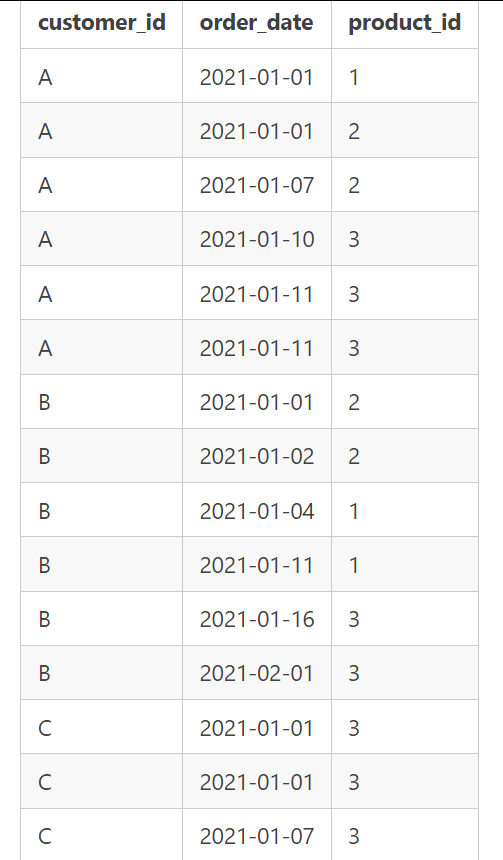
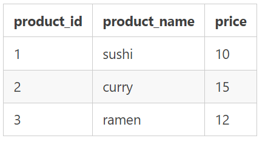
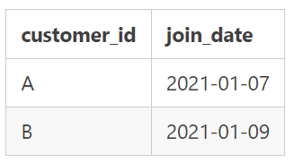

# INTRODUCTION
Hi, I have been learning SQL for a while and I stumbled on Danny's Diner 8 weeks SQL challenge, So I partook in this challenge. This project enabled me put to work all that has been learnt overtime. 

# PROBLEM STATEMENT
Danny wants to use the data to answer a few simple questions about his customers, especially about their visiting patterns, how much money they’ve spent and also which menu items are their favourite. Having this deeper connection with his customers will help him deliver a better and more personalised experience for his loyal customers.

He plans on using these insights to help him decide whether he should expand the existing customer loyalty program - additionally he needs help to generate some basic datasets so his team can easily inspect the data without needing to use SQL.

Danny has provided you with a sample of his overall customer data due to privacy issues - but he hopes that these examples are enough for you to write fully functioning SQL queries to help him answer his questions!

Danny has shared with you 3 key datasets for this case study:
- Sales
- Menu
- Members 

# SKILLS DEMONSTRATED
I used PostgreSQL, putting to use clauses like WHERE, LIMIT, GROUP BY, ORDER BY, JOINS, WINDOWS FUNCTION 

# DATA SOURCING
 All datasets exist within the dannys_diner database schema and can be found [here](https://8weeksqlchallenge.com/case-study-1/).

 
 ### Table 1: Sales
 
 The sales table captures all customer_id level purchases with an corresponding order_date and product_id information for when and what menu items were ordered. 
 

 
 ### Table 2: Menu

The menu table maps the product_id to the actual product_name and price of each menu item.

### Table 3: Members

The final members table captures the join_date when a customer_id joined the beta version of the Danny’s Diner loyalty program.

 

 

			
# DATA ANALYSIS AND VISUALISATION
# CONCLUSION
